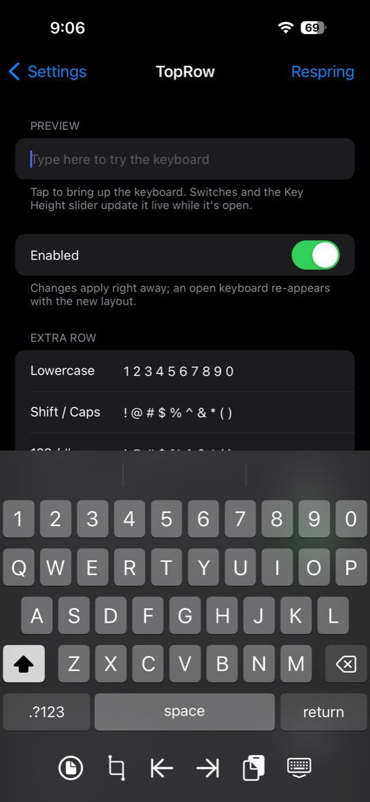
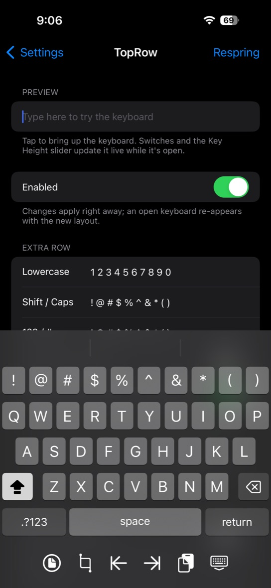
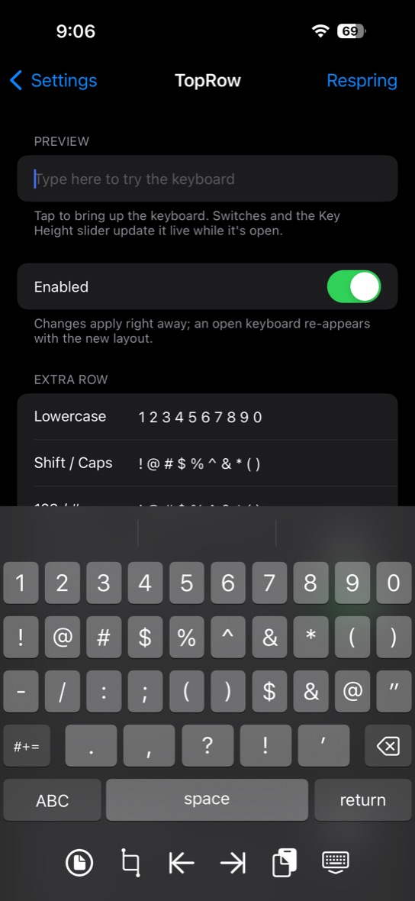
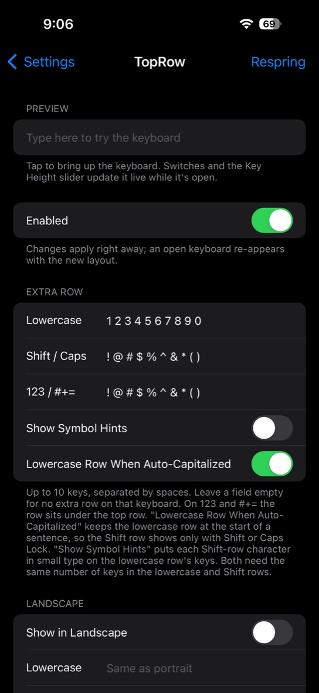
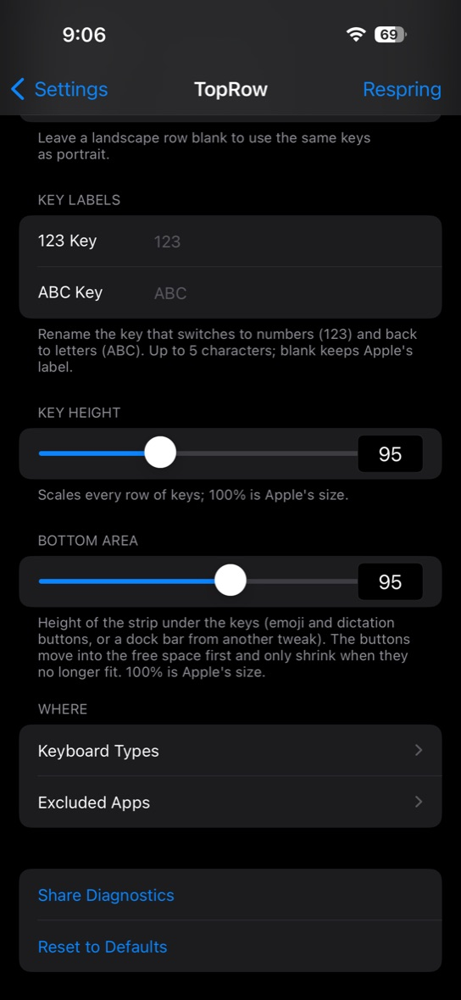

# TopRow

A number row for the stock iOS keyboard. Free, open source, and adjustable without a respring.

- **Letters:** `1 2 3 4 5 6 7 8 9 0`
- **Shift / Caps Lock:** `! @ # $ % ^ & * ( )`
- **123 and #+=:** an extra `! @ # $ % ^ & * ( )` row under the digits

<p>
  
  
  
  
  
</p>

## Features

- Edit every row: 1–10 keys, up to 8 characters per key
- Keep the digit row while the keyboard is only auto-capitalized
- Symbol hints in the corner of each number key
- Key Height (80–130%) and Bottom Area (60–130%) sliders
- Landscape on/off, with optional separate landscape rows
- Custom labels for the 123 and ABC keys
- Per-app exclusion (AltList) and per-keyboard-type control (email, web, Twitter)
- Works in password fields, share sheets and password managers' AutoFill sheets; number, phone and passcode pads stay stock
- Every setting applies live; a preview field sits right in the settings page
- **Share Diagnostics** exports a plain-text report for bug reports

## Install

Add **https://dev.rtrdd.fyi** to Sileo or Zebra and install **TopRow**, or download the `.deb` from [Releases](https://github.com/U-rTrDD-fyi/TopRow/releases).

Requirements: iPhone on a rootless jailbreak, iOS 15 or later. Developed and tested on iOS 17.3.1 with Dopamine (and the iOS 18.4 simulator); reports from other versions are welcome. Depends on PreferenceLoader and AltList. Does nothing on iPad. Uninstall any other number-row tweak first; two of them on the same keyboard will clash.

## Build

GitHub Actions builds every push on a macOS runner and publishes a release for each `v*` tag (see `.github/workflows/build.yml`). To build locally you need [Theos](https://theos.dev) and [AltList](https://github.com/opa334/AltList) (extract `AltList.framework` from the `com.opa334.altlist` package on https://opa334.github.io into `$THEOS/lib/iphone/rootless/`, as the workflow does).

```sh
cd tweak
make package FINALPACKAGE=1
```

The package lands in `tweak/packages/`. The Makefile targets the iOS 17.3.1 SDK; to build with another, pass `TARGET=iphone:clang:<sdk>:15.0`. `make do` installs over SSH using `THEOS_DEVICE_IP` and `THEOS_DEVICE_PORT`.

## How it works

UIKit builds each keyboard from a tree of `UIKBTree` nodes that it gets from `-[TUIKBGraphSerialization keyboardForName:]`. TopRow hooks that method and returns a patched deep copy of the tree:

1. Every keyplane (lowercase, shifted, 123, #+=) is copied, and the extra row's keys are merged into an existing row. Everything below moves down one row pitch, keeping Apple's key sizes and gaps.
2. Keys copy their geometry from the row they sit over, or are spread evenly when the row has a different key count.
3. UIKit caches rendered keyplane images by keyset and geometry-set names, not by labels. The settings fingerprint is therefore folded into those names, so a changed row never reuses stale artwork.
4. A Darwin notification from the settings pane reloads the configuration and rebuilds the keyboard in place.

The rest is small hooks: `UIKeyboardLayoutStar` for the auto-capitalization option and the 123/ABC labels, `UIKBKeyplaneView` for symbol hints, and `UIKeyboardDockView` for the Bottom Area slider.

| File | What it does |
| --- | --- |
| `tweak/Tweak.m` | Hooks, live reload, Bottom Area, hints, labels |
| `tweak/TPRPatcher.m` | Copies and patches keyboard trees |
| `tweak/TPRConfig.m` | Reads and validates settings; the single config snapshot |
| `tweak/TPRTree.m` | Guarded helpers for UIKit's private tree objects |
| `tweak/prefs/` | The settings pane (PreferenceLoader bundle) |
| `tools/sim/` | Simulator test bench (see below) |

## Simulator test bench

`tools/sim/tpr-sim.sh` builds a small host app plus a simulator build of the tweak, then drives the keyboard from the command line: switch planes, hit-test rows, change keyboard types, rotate and take screenshots. Put your simulator's UDID in `tools/sim/.udid`, then:

```sh
tools/sim/tpr-sim.sh build
tools/sim/tpr-sim.sh launch tweak
tools/sim/tpr-sim.sh cmd 'info' 'hitrow 30'
```

## License

MIT. See [LICENSE](LICENSE).
